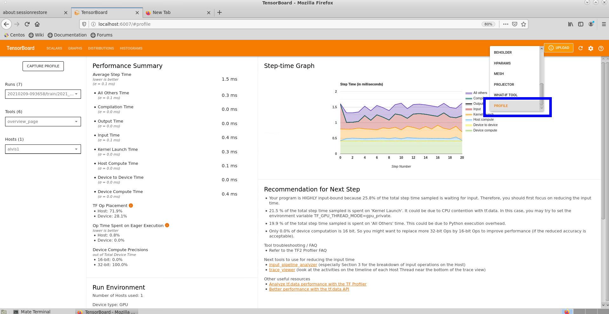

# Introduction
In this tutorial, we'll show you how to profile a model and view the results using TensorBoard 
with TensorFlow and HolisticTraceAnalysis (HTA) with PyTorch.

## PyTorch
For profiling with PyTorch you'll need PyTorch 1.8.1 or higher to access the
`torch.profiler` module. To see the results of the profiling with HTA tool
you'll also need to load HolisticTraceAnalysis module.

### Environment setup
To run the code you can either use the module tree
```
module purge
ml PyTorch-bundle/2.1.2-foss-2023a-CUDA-12.1.1
ml matplotlib/3.7.2-gfbf-2023a
ml load HolisticTraceAnalysis/0.2.0-gfbf-2023a
ml JupyterLab/4.0.5-GCCcore-12.3.0

jupyter lab
```
or a provided singularity container
```
singularity exec /apps/containers/PyTorch/PyTorch-1.14-NGC-23.02.sif jupyter notebook 
```

You'll probably want to run the code on a compute node to get access to the
TMPDIR for faster file I/O. To do this you can use
`sbatch jobscript-pytorch.sh`.
Open up the jupyter server and follow the instructions in `profiling-pytorch.ipynb`

### Profiling
Once the environment is set up, profiling your PyTorch code with HTA is straightforward. Simply wrap
the code you want to profile with a profile context manager and export the trace data for HTA analysis:
```python
import torch.profiler
from hta.trace_analysis import TraceAnalysis

with torch.profiler.profile(
    on_trace_ready=torch.profiler.schedule(),
) as prof:
    # Code to profile
    #...
analyzer = TraceAnalysis(trace_dir=trace_dir)
# Code to HTA
#...
```

## Tensorflow
In this tutorial we will show how to profile a TensorFlow model using the
built-in TensorBoard profiler.  We make use of the `tensorboard` command-line
utility for visualization and the `tensorflow.keras.callbacks.TensorBoard`
API-callback to collect profiling data. This example is only to show the built-in profiler
in TensorBoard can easily be used it conjunctin with TensorFlow. The model trains the
MNIST-database, but you can of course experiment with other datasets and models
as well. Lastly, TensorBoard supports other ML-libraries as well, such as PyTorch.

### Environment setup
You need to complete a few steps before you can run this example. The environment only
needs to load the TensorFlow module as TensorBoard comes bundled with TensorFlow.

```
flat_modules
ml purge
ml TensorFlow/2.15.1-foss-2023a-CUDA-12.1.1
ml matplotlib/3.7.2-gfbf-2023a
ml JupyterLab/4.0.5-GCCcore-12.3.0
```

### Running the code
You'll probably want to run the code on a compute node to get access to the
TMPDIR for faster file I/O. To do this you can use
`sbatch jobscript-tensorflow.sh`.

Open up the jupyter server and follow the instructions in `profiling-tensorflow.ipynb`

### Generate the profiling data
The profiling data will be created inside a directory `logs` in you current
working directory.

### Start TensorBoard
Once the profiling data has been genereated we can start TensorBoard.
The`tensorboard` command-line utility starts a web server listening on
localhost, as seen below. 
```
tensorboard --logdir logs
2021-02-09 11:54:44.785607: I tensorflow/stream_executor/platform/default/dso_loader.cc:48] Successfully opened dynamic library libcudart.so.10.1
Serving TensorBoard on localhost; to expose to the network, use a proxy or pass --bind_all
TensorBoard 2.3.0 at http://localhost:6007/ (Press CTRL+C to quit)
```
In the above example we need to visit `http://localhost:6007/` on the login
node - your port may be different.

You will need to either use ThinLinc (see [Connecting with ThinLinc](https://www.c3se.chalmers.se/documentation/remote_graphics/))
and connect to the Alvis logi node, or (recommended) setup a [SSH tunnel](https://www.c3se.chalmers.se/documentation/connecting/#use-ssh-tunnel-to-access-services)
to access the UI from your computer.

On the TensorBoard UI you select "Profile" in the drop-down menu next to the UPLOAD button.


